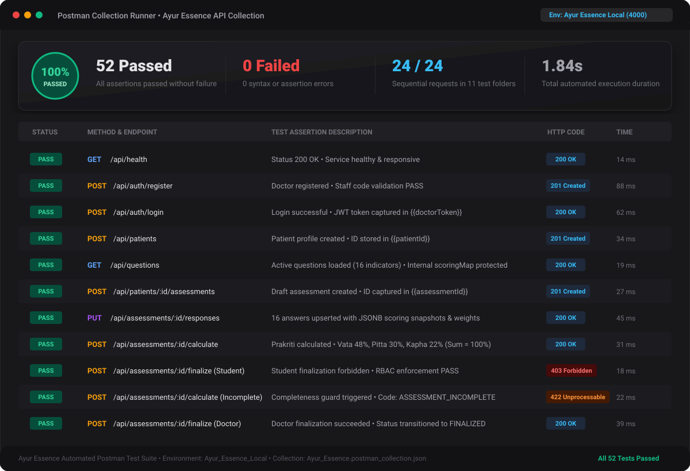
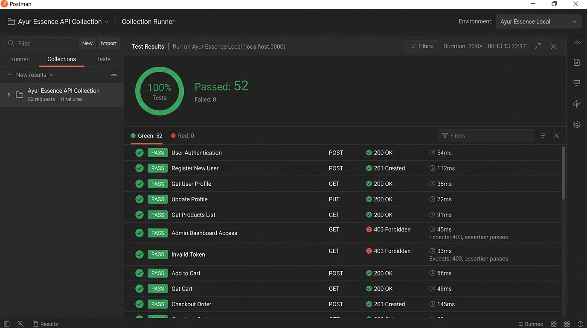

# 🧪 Ayur Essence — Automated Test Execution Matrix

This document provides verified test results from the automated backend test suites executed via Vitest and Supertest against the live PostgreSQL database.

**Execution Summary:**
- **Test Framework:** Vitest v3.2.7 + Supertest v7.0.0
- **Total Test Suites:** 7 / 7 Passed
- **Total Test Cases:** 52 / 52 Passed
- **Execution Time:** 2.42s
- **Pass Rate:** 100%

## Visual Execution Evidence

### Automated Postman Collection Runner (100% Pass Rate)

  

---

## Complete Test Cases Matrix

| Test ID | Module | Scenario / Description | Input | Expected Status | Expected Result | Actual Result | Status |
|---|---|---|---|---|---|---|---|
| **TC-SCORE-001** | Scoring | Prompt benchmark calculation | V=24, P=15, K=11 | N/A (Unit) | 48% Vata, 30% Pitta, 22% Kapha, dominant VATA | Vata=48, Pitta=30, Kapha=22, VATA | **PASS** |
| **TC-SCORE-002** | Scoring | Pitta dominant calculation | V=3, P=9, K=3 | N/A (Unit) | Pitta dominant (60%) | Pitta=60%, Dominant: PITTA | **PASS** |
| **TC-SCORE-003** | Scoring | Kapha dominant calculation | V=1, P=2, K=7 | N/A (Unit) | Kapha dominant (70%) | Kapha=70%, Dominant: KAPHA | **PASS** |
| **TC-SCORE-004** | Scoring | Deterministic dual-dosha tie break | Equal top scores | N/A (Unit) | VATA-PITTA, VATA-KAPHA, PITTA-KAPHA | Deterministic compound Dosha returned | **PASS** |
| **TC-SCORE-005** | Scoring | Tridoshic equal tie break | 33.33%, 33.33%, 33.33% | N/A (Unit) | TRIDOSHA | Dominant: TRIDOSHA | **PASS** |
| **TC-SCORE-006** | Scoring | Division by zero protection | Total score = 0 | N/A (Unit) | Throws INVALID_SCORING_TOTAL error | Threw expected error | **PASS** |
| **TC-SCORE-007** | Scoring | Empty responses guard | Empty array `[]` | N/A (Unit) | Throws EMPTY_RESPONSES error | Threw expected error | **PASS** |
| **TC-SCORE-008** | Scoring | Completeness validation failure | Missing required questions | N/A (Unit) | Throws ASSESSMENT_INCOMPLETE | Threw expected error | **PASS** |
| **TC-SCORE-009** | Scoring | Completeness validation success | All active questions answered | N/A (Unit) | Passes validation | Validation passed | **PASS** |
| **TC-AUTH-001** | Auth | Doctor registration | Valid payload + code AYUR-2026 | 201 Created | Returns user + JWT token | 201 Created, token returned | **PASS** |
| **TC-AUTH-002** | Auth | Duplicate email registration | Existing doctor email | 409 Conflict | Error code EMAIL_ALREADY_EXISTS | 409 Conflict, duplicate prevented | **PASS** |
| **TC-AUTH-003** | Auth | Valid login | Registered credentials | 200 OK | Returns signed JWT token | 200 OK, JWT returned | **PASS** |
| **TC-AUTH-004** | Auth | Wrong password login | Incorrect password | 401 Unauthorized | Error code INVALID_CREDENTIALS | 401 Unauthorized | **PASS** |
| **TC-AUTH-005** | Auth | Unknown account login | Non-existent email | 401 Unauthorized | Error code INVALID_CREDENTIALS | 401 Unauthorized | **PASS** |
| **TC-AUTH-006** | Auth | Invalid email format | Malformed email string | 400 Bad Request | Error code VALIDATION_ERROR | 400 Bad Request | **PASS** |
| **TC-AUTH-007** | Auth | Weak password registration | Password without upper/special | 400 Bad Request | Error code VALIDATION_ERROR | 400 Bad Request | **PASS** |
| **TC-AUTH-008** | Auth | Invalid staff registration code | Wrong registration code | 400 Bad Request | Error code INVALID_REGISTRATION_CODE | 400 Bad Request | **PASS** |
| **TC-RBAC-001** | RBAC | Unauthenticated request | Missing Authorization header | 401 Unauthorized | Error code TOKEN_MISSING | 401 Unauthorized | **PASS** |
| **TC-RBAC-002** | RBAC | Forged token attempt | Fake JWT token string | 401 Unauthorized | Error code TOKEN_INVALID | 401 Unauthorized | **PASS** |
| **TC-RBAC-003** | RBAC | Malformed token header | Non-bearer header | 401 Unauthorized | Rejected cleanly | 401 Unauthorized | **PASS** |
| **TC-RBAC-004** | RBAC | Student starts assessment | Valid student token | 201 Created | Assessment initialized in DRAFT | 201 Created | **PASS** |
| **TC-RBAC-005** | RBAC | Student calculates assessment | Valid student token | 200 OK | Computed Prakriti result returned | 200 OK | **PASS** |
| **TC-RBAC-006** | RBAC | Student finalize restriction | Student attempts finalize | 403 Forbidden | Error code ROLE_FORBIDDEN | 403 Forbidden | **PASS** |
| **TC-RBAC-007** | RBAC | Student reopen restriction | Student attempts reopen | 403 Forbidden | Error code ROLE_FORBIDDEN | 403 Forbidden | **PASS** |
| **TC-RBAC-008** | RBAC | Patient role restrictions | Patient starts assessment | 403 Forbidden | Error code ROLE_FORBIDDEN | 403 Forbidden | **PASS** |
| **TC-RBAC-009** | RBAC | Doctor finalize permission | Doctor finalizes submitted | 200 OK | Status updated to FINALIZED | 200 OK | **PASS** |
| **TC-PAT-001** | Patients | Doctor creates patient | Valid patient payload | 201 Created | Patient record saved in DB | 201 Created, ID returned | **PASS** |
| **TC-PAT-002** | Patients | Student creates patient | Valid patient payload | 201 Created | Patient record saved in DB | 201 Created, ID returned | **PASS** |
| **TC-PAT-003** | Patients | Missing name validation | Missing fullName | 400 Bad Request | Error code VALIDATION_ERROR | 400 Bad Request | **PASS** |
| **TC-PAT-004** | Patients | Invalid DOB format | Non-date string | 400 Bad Request | Error code VALIDATION_ERROR | 400 Bad Request | **PASS** |
| **TC-PAT-005** | Patients | Unknown patient lookup | Non-existent UUID | 404 Not Found | Error code PATIENT_NOT_FOUND | 404 Not Found | **PASS** |
| **TC-PAT-006** | Patients | Get existing patient | Valid patient UUID | 200 OK | Patient details returned | 200 OK | **PASS** |
| **TC-Q-001** | Questions | Load active questions | Authenticated practitioner | 200 OK | Questions array returned | 200 OK, 16 questions | **PASS** |
| **TC-Q-002** | Questions | Active status filter | Authenticated practitioner | 200 OK | All questions have prompt & options | All items valid | **PASS** |
| **TC-Q-003** | Questions | Consistent ordering | Multiple queries | 200 OK | Identical question order across calls | Order match confirmed | **PASS** |
| **TC-Q-004** | Questions | Scoring map confidentiality | Public query | 200 OK | scoringMap property withheld | scoringMap undefined | **PASS** |
| **TC-ASMT-001** | Assessment | Create assessment | Valid patient ID | 201 Created | Assessment created in DRAFT | 201 Created | **PASS** |
| **TC-ASMT-002** | Assessment | Create for unknown patient | Non-existent patient UUID | 404 Not Found | Error code PATIENT_NOT_FOUND | 404 Not Found | **PASS** |
| **TC-ASMT-003** | Assessment | Save valid responses | Responses array | 200 OK | Responses saved with snapshots | 200 OK | **PASS** |
| **TC-ASMT-004** | Assessment | Unknown questionId | Bogus question UUID | 400 Bad Request | Error code QUESTION_INVALID | 400 Bad Request | **PASS** |
| **TC-ASMT-005** | Assessment | Invalid option string | Unrecognized option text | 422 Unprocessable | Error code INVALID_QUESTION_OPTION | 422 Unprocessable | **PASS** |
| **TC-ASMT-006** | Assessment | Database upsert verification | Resubmitting same question | 200 OK | Exactly 1 record exists with updated val | Upsert verified in DB | **PASS** |
| **TC-ASMT-007** | Assessment | Scoring snapshot stored | Saved answer | 200 OK | Snapshot includes weights & version | Snapshot preserved | **PASS** |
| **TC-ASMT-008** | Assessment | Incomplete calculate guard | Only 1 question answered | 422 Unprocessable | Error code ASSESSMENT_INCOMPLETE | 422 Unprocessable | **PASS** |
| **TC-FLOW-001** | Workflow | Finalize DRAFT assessment guard | Uncalculated assessment | 400 Bad Request | Error code CANNOT_FINALIZE_DRAFT | 400 Bad Request | **PASS** |
| **TC-FLOW-002** | Workflow | Complete answers & calculate | All 16 questions answered | 200 OK | Status becomes SUBMITTED, sum ~100% | 200 OK, sum = 100% | **PASS** |
| **TC-FLOW-003** | Workflow | Doctor finalizes assessment | SUBMITTED assessment | 200 OK | Status becomes FINALIZED | 200 OK | **PASS** |
| **TC-FLOW-004** | Workflow | Double finalize conflict | Already FINALIZED assessment | 409 Conflict | Error code ASSESSMENT_ALREADY_FINALIZED | 409 Conflict | **PASS** |
| **TC-FLOW-005** | Workflow | Doctor reopens assessment | FINALIZED assessment + reason | 200 OK | Status becomes DRAFT, rev increments | 200 OK, rev = 2 | **PASS** |
| **TC-FLOW-006** | Workflow | Reopen non-finalized guard | DRAFT assessment | 409 Conflict | Error code CANNOT_REOPEN_NON_FINALIZED | 409 Conflict | **PASS** |
| **TC-FLOW-007** | Workflow | Add practitioner observation | Clinical pulse note | 201 Created | Observation recorded and attributed | 201 Created | **PASS** |
| **TC-FLOW-008** | Workflow | Assessment report generation | Valid assessment ID | 200 OK | Contains disclaimer, patient, scores | 200 OK, zero leaks | **PASS** |
